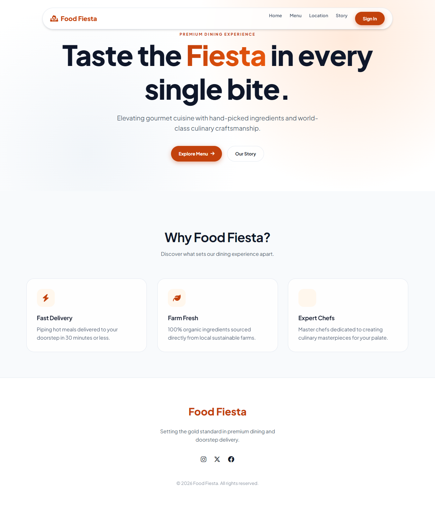
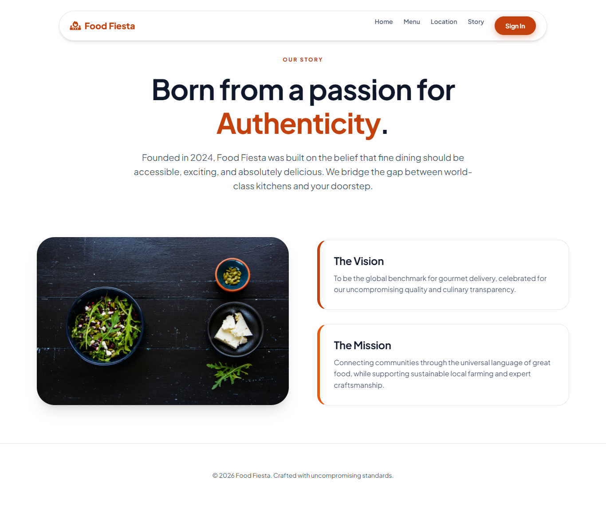
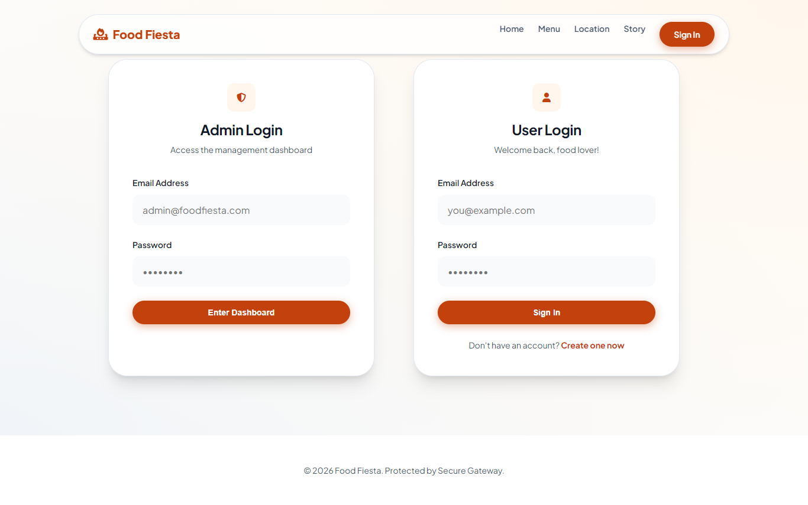
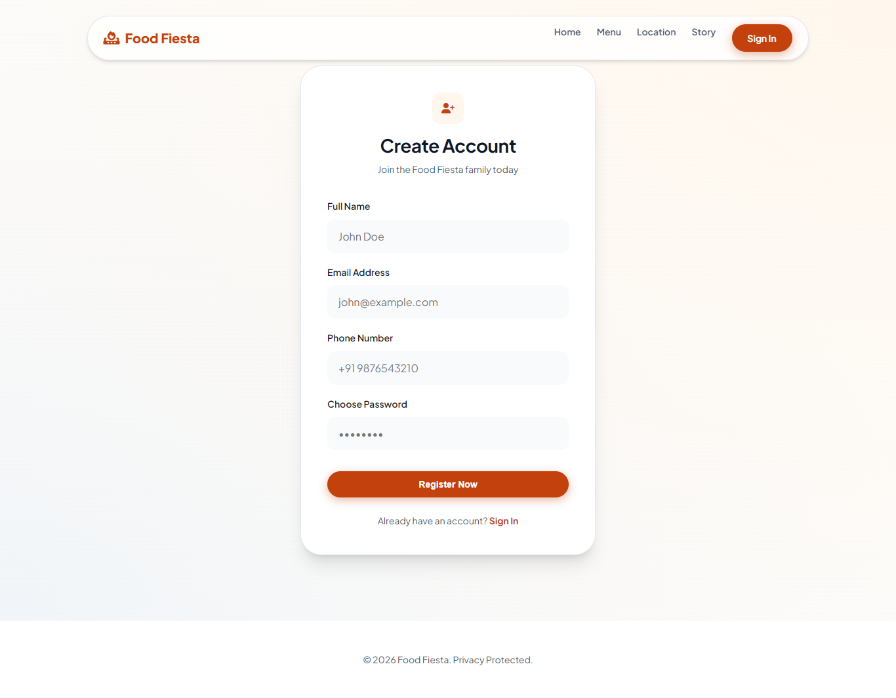
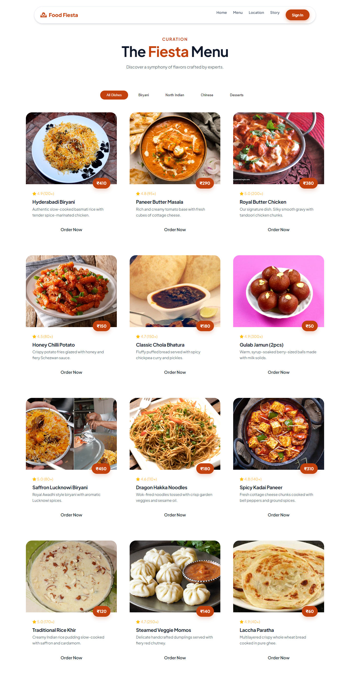
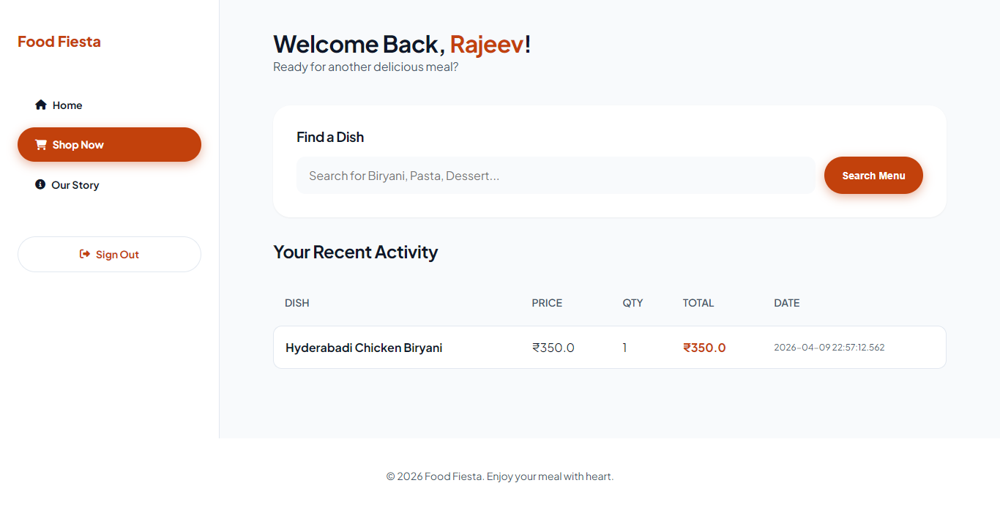
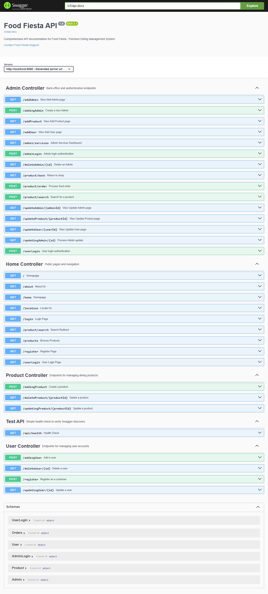
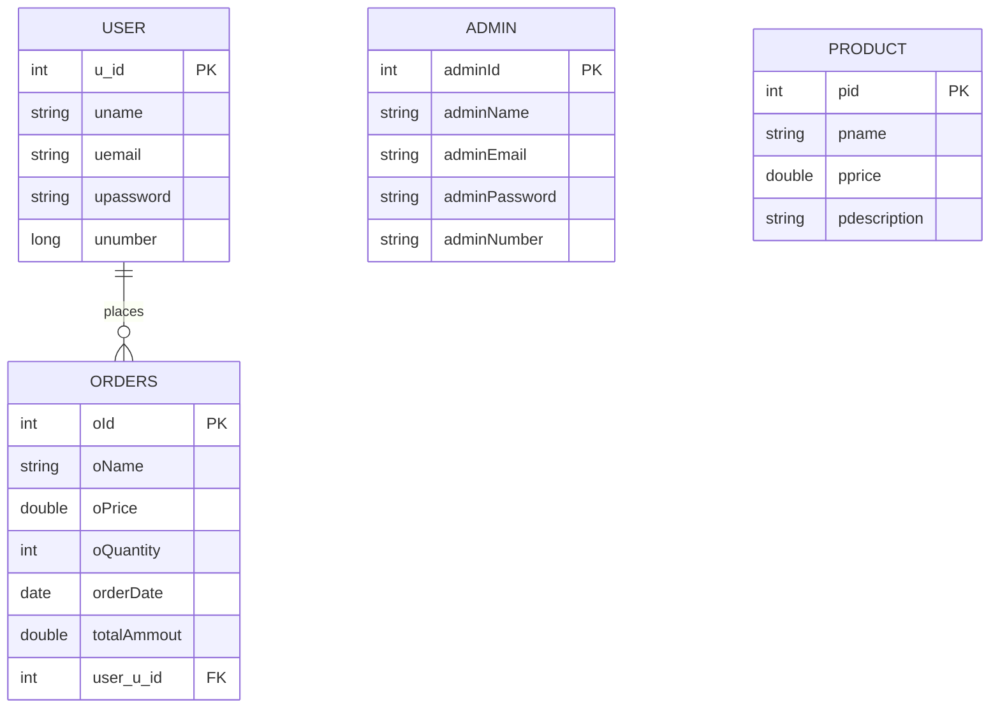

# Food Fiesta - Spring Boot Fullstack Project

**Food Fiesta** is a Spring Boot fullstack dining management application built with **Java 21**, **Spring Boot 3.4.2**, **Thymeleaf**, **Spring Security**, **Spring Data JPA**, and **H2** for quick local development.

The project can also be configured to use PostgreSQL for deployment or production-style testing.

## Project Tags

`#SpringBoot` `#Java21` `#RestAPI` `#BackendProject` `#H2Database` `#PostgreSQL` `#Thymeleaf` `#FullstackProject`

---

[](https://spring.io/projects/spring-boot)
[](https://www.oracle.com/java/)
[](https://www.h2database.com/)
[](https://swagger.io/)
[](LICENSE)

---

## Interface Preview

### Home Page

<p align="center">
  
</p>

### About Page

<p align="center">
  
</p>

### Authentication & Security

<p align="center">
  
  
</p>

### Products

<p align="center">
  
</p>

### User Experience & Dashboard

<p align="center">
  
</p>

### Admin Management Console

<p align="center">
  
</p>

### API Documentation

<p align="center">
  
</p>

---

## Core Features

- Premium Thymeleaf UI with modern CSS and JavaScript.
- Role-based admin and customer flows.
- Product inventory management.
- User registration and login.
- Order placement and order history.
- Spring Data JPA persistence.
- H2 database for fast local startup.
- Swagger/OpenAPI documentation.
- Optional Google OAuth2 login configuration.

---

## Technology Stack

| Layer | Technology |
| :--- | :--- |
| Backend | Java 21, Spring Boot 3.4.2, Spring Security, Hibernate |
| Database | H2 for local development, PostgreSQL optional |
| Documentation | SpringDoc OpenAPI / Swagger UI |
| Frontend | Thymeleaf, CSS, JavaScript |
| Build Tool | Maven Wrapper |
| API Testing | Swagger, Postman |

---

## Database Architecture



---

## Prerequisites

- JDK 21
- Maven is optional because the Maven wrapper is included

Docker and PostgreSQL are only needed if you choose the PostgreSQL/Docker setup.

---

## Quick Start With H2

Clone the project:

```bash
git clone https://github.com/imrajeevnayan/Food-Fiesta.git
cd Food-Fiesta
```

Run the application:

```bash
./mvnw spring-boot:run
```

On Windows PowerShell:

```powershell
.\mvnw.cmd spring-boot:run
```

If `JAVA_HOME` is not set on Windows, set it before running Maven:

```powershell
$env:JAVA_HOME="C:\Program Files\Java\jdk-21.0.11"
.\mvnw.cmd spring-boot:run
```

Open the app:

- Frontend: [http://localhost:8080/](http://localhost:8080/)
- Swagger UI: [http://localhost:8080/swagger-ui/index.html](http://localhost:8080/swagger-ui/index.html)
- H2 Console: [http://localhost:8080/h2-console](http://localhost:8080/h2-console)

H2 console connection:

```text
JDBC URL: jdbc:h2:mem:foodfiesta
User Name: sa
Password:
```

The H2 database is in-memory, so data resets when the application stops.

---

## Default Seeded Data

The app seeds sample products and a default admin account on startup.

```text
Admin email: admin@foodfiesta.com
Admin password: admin123
```

---

## Current Local Database Configuration

The default `src/main/resources/application.properties` uses H2:

```properties
spring.datasource.url=jdbc:h2:mem:foodfiesta
spring.datasource.driver-class-name=org.h2.Driver
spring.datasource.username=sa
spring.datasource.password=
spring.h2.console.enabled=true
spring.h2.console.path=/h2-console
spring.jpa.hibernate.ddl-auto=create-drop
```

---

## Optional PostgreSQL Configuration

To use PostgreSQL instead of H2, update `src/main/resources/application.properties`:

```properties
spring.datasource.url=jdbc:postgresql://localhost:5432/foodfiesta
spring.datasource.username=postgres
spring.datasource.password=YOUR_PASSWORD
spring.jpa.properties.hibernate.dialect=org.hibernate.dialect.PostgreSQLDialect
spring.jpa.hibernate.ddl-auto=update
```

PostgreSQL should be running on port `5432`, and the `foodfiesta` database should exist.

---

## Optional Google OAuth2

To enable Google login:

1. Go to [Google Cloud Console](https://console.cloud.google.com/).
2. Create an OAuth 2.0 Client ID.
3. Add this authorized redirect URI:

```text
http://localhost:8080/login/oauth2/code/google
```

4. Update `src/main/resources/application.properties`:

```properties
spring.security.oauth2.client.registration.google.client-id=YOUR_CLIENT_ID
spring.security.oauth2.client.registration.google.client-secret=YOUR_CLIENT_SECRET
```

---

## Docker Deployment

Build the image:

```bash
docker build -t food-fiesta .
```

Run with Docker:

```bash
docker run -p 8080:8080 --name food-fiesta-app food-fiesta
```

Run app and PostgreSQL together:

```bash
docker compose up -d
```

Follow logs:

```bash
docker compose logs -f app
```

---

## Build

```bash
./mvnw clean package
```

On Windows:

```powershell
.\mvnw.cmd clean package
```

---

## License

Distributed under the MIT License. See [LICENSE](LICENSE) for details.

---

Developed by **imrajeevnayan**
